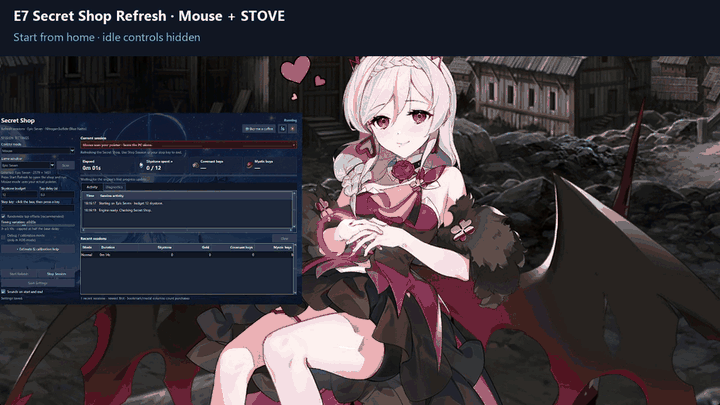

# E7 Secret Shop Refresh

Automatically open Epic Seven's Secret Shop, buy Covenant Bookmarks and Mystic
Medals, and refresh within your Skystone budget. Windows app by
**NitrogenSulfide (Blue Natto)**, based on Solunium's GPL-3.0 engine.

## EZ Mode · download, extract, start

**[Download the Windows app — v0.1.1](https://github.com/NitrogenSulfide/Epic-Seven-E7-Secret-Shop-Refresh/releases/download/v0.1.1/E7ShopRefresh-0.1.1.zip)**

> **Ban risk:** This is unofficial automation. [Smilegate's terms](https://common.game.onstove.com/terms/index?gameType=MOBILE&langCode=en&termsType=1) prohibit unauthorized scripts and macros. Account penalties, including bans, are possible; use at your own risk.

1. Extract the **whole ZIP**, then open **E7 Secret Shop Refresh.exe**. Python is included.
2. Open **English Epic Seven** at home or in Secret Shop. Close any popups; hidden idle home controls are handled automatically.
3. Leave **Mouse** selected and choose your **game window**. Use **Scan** if needed.
4. Set your **Skystone budget** and check the **Stop key**, then press **Start Refresh**.

If the app offers to **restart as administrator**, accept the restart and Windows
permission prompt. Once it reopens, select your game and press **Start Refresh**
again. This is only needed when the selected game runs with administrator permission.

**While Mouse runs:** leave the PC alone, keep the game uncovered, and avoid moving
or resizing its window. **To stop:** press your configured Stop key (default: the
backtick key, usually below Esc) or click **Stop Session**. Start with a small budget
for your first run.

**[Detailed setup / troubleshooting](release/SETUP.md)** ·
**[What's new in v0.1.1](https://github.com/NitrogenSulfide/Epic-Seven-E7-Secret-Shop-Refresh/releases/tag/v0.1.1)**

## See it work · Mouse on STOVE

Hidden home controls → Secret Shop → automatic Covenant Bookmark purchase.
This real-time clip ends just after the purchase; account details are covered.

**[Watch / download the MP4](https://github.com/NitrogenSulfide/Epic-Seven-E7-Secret-Shop-Refresh/releases/download/v0.1.1/mouse-stove-demo.mp4)** · approximately 14 seconds

## Tested game clients

| Game client | Mouse | ADB |
| --- | --- | --- |
| Google Play Games on PC **Developer Emulator** | Tested | Tested |
| Official native STOVE client | Tested | Unavailable |

Testing is limited to these two clients. Other emulators and methods have not been
tested. Use English game text and a readable landscape 16:9 game view of at least
640 × 360. Native STOVE Mouse mode also supports its wider maximized client area.
ADB calibration requires a 1920 × 1080 Android display.

## ADB mode · optional

ADB lets you use your PC pointer normally while the app runs through the emulator.
Native STOVE does not support ADB.

1. Enable and authorize ADB debugging in your emulator.
2. Switch **Control mode → ADB**, then select the device. Google Developer Emulator uses **localhost:6520**; use **Scan** if needed.
3. Open Epic Seven at home or in Secret Shop, check your budget and Stop key, then press **Start Refresh**.

See the [setup guide](release/SETUP.md) if the device isn't detected.

## Features and updates

Live counters, used/total Skystone budget, configurable Stop key, smooth Mouse
movement and dragging, randomized tap offsets, adjustable timing variation up to
±0.10 seconds, session history, day/night themes, and in-app Quickstart/release notes.
Calibration is ADB-only. Only Covenant Bookmarks and Mystic Medals are purchased.

The app verifies shop controls and confirmation text before continuing. Unknown or
changed screens can stop a session. Passing tested cases does not establish support
for every wallpaper/layout or uninterrupted long runs; insufficient-currency
stopping has not been live-tested. See [regression coverage](docs/AUTOMATION-REGRESSIONS.md).

**Updating:** back up your settings and history under `runtime` before switching to
a new extracted release. There is no automatic updater or migration. Personal
runtime data is excluded from release ZIPs.

## Source and credits

The optional **E7Source-0.1.1.zip** contains the maintained source and rebuild
instructions. Matching GUI/engine source is also supplied with the player package.
See [build instructions](release/BUILDING.md) and [engine notes](ENGINE.md).

Software is GPL-3.0; see [LICENSE](LICENSE), [CREDITS.txt](CREDITS.txt) and
[upstream notices](UPSTREAM.md). Third-party artwork/audio retain their respective
rights and provenance. This is an independent community tool with no official
endorsement. Upstream source history is preserved.

Optional support: [Buy me a coffee](https://ko-fi.com/bluenatto).
