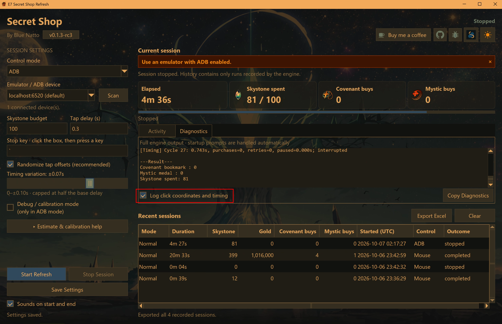

# v0.1.3 — Session history and optional diagnostics

Optional **Log click coordinates and timing** in Diagnostics makes offsets and
pacing easier to inspect in both Mouse and ADB. It defaults off and is independent
of ADB calibration. Logs show applied coordinates, mapped screen/device pixels,
sampled and measured waits, and refresh-cycle totals including purchases, retries
and focus pauses. Initial/final scans and interrupted intervals are labelled.
Detailed output and saved session logs have size limits; logs stay local.

Session history now records UTC start time, control mode, outcome and stop/failure
reason. **Export Excel** includes every saved session with numeric counters and
totals. Loading older CSV history preserves the original before schema migration.
The matching Mouse and ADB engines accept cooperative Stop and interrupt waits.

The header adds a version link and bug-report shortcut. The timing slider is
larger and scales with DPI. Tap delay, including random variation, is capped at
two seconds. Background repaint work is reduced, though 4K resizing and theme
repaint can still lag; further rendering work is deferred.

The owner reports passing live Mouse and ADB regression runs on the rc3 candidate.
Saved Mouse evidence includes 133 refreshes (399 Skystones), four Covenant buys
and one Mystic buy. Saved ADB evidence includes a cooperative Stop at 81 Skystones.
The final stable package has matching source with release metadata changes and
separate offline verification; it has not had an additional live currency run.
Testing remains limited to native STOVE Mouse and Google Play Games Developer
Emulator Mouse/ADB. Other emulators and insufficient-currency stopping remain
unverified.

Download **E7ShopRefresh-0.1.3.zip**, extract the whole ZIP into a fresh folder,
and open **E7 Secret Shop Refresh.exe**. Back up settings/history in the old
`runtime` before updating. The optional **E7Source-0.1.3.zip** is for developers.
Use the matching bundled engine. See [setup](SETUP.md) for details.
